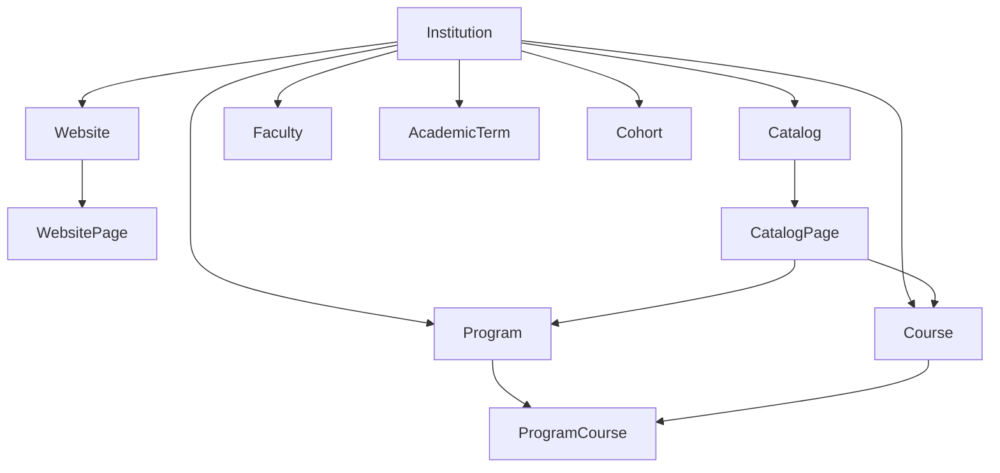

# SeminaryOS Domain Model

## Purpose

This document defines the initial commercial multi-institution domain model for **SeminaryOS / University in a Box**.

This version intentionally limits scope to these modules only:

1. Institution
2. Website
3. Programs
4. Courses
5. Catalog Engine

The following areas are explicitly out of scope for this phase and must not be designed as active business modules yet:

- Admissions
- Students
- Payments
- Grades
- Transcripts
- Certificates
- LMS features

## Core Domain Rules

- Every major record belongs to an institution.
- The Institution module is the root module.
- The Website module controls public-facing pages.
- The Programs module manages academic programs.
- The Courses module manages academic courses.
- The Catalog Engine generates public catalog pages from program and course records.
- Programs can contain many courses.
- Courses can belong to many programs.
- Programs and courses must support draft/published status.
- Programs and courses must support `seo_title`, `seo_description`, and `slug`.
- Catalog pages must be generated dynamically from database records, not manually duplicated.
- Public pages should be server-rendered with Blade/Livewire.
- Admin management should use Filament.
- The system must remain compatible with ICDSoft shared hosting.

## Build Order

### Phase 1
Institution foundation

### Phase 2
Website foundation

### Phase 3
Programs module

### Phase 4
Courses module

### Phase 5
Catalog Engine

## Entity Overview

---

## 1. Institution

### What it is
The root tenant entity representing a seminary, university, college, or institute using the platform.

### What it is not
- Not a website page
- Not a program container only
- Not a user account
- Not a subscription or billing object in this phase

### Required fields
- `id`
- `uuid`
- `name`
- `slug`
- `type`
- `status`

### Optional fields
- `legal_name`
- `short_name`
- `tagline`
- `email`
- `phone`
- `website_url`
- `address_line1`
- `address_line2`
- `city`
- `state`
- `postal_code`
- `country`
- `timezone`
- `locale`
- `settings` JSON
- `logo_path`
- `primary_color`
- `secondary_color`

### Relationships to other entities
- Has one or many websites
- Has many website pages through website
- Has many programs
- Has many courses
- Has many catalogs
- Has many faculty placeholders
- Has many academic term placeholders
- Has many cohort placeholders

### Whether it belongs to an institution
No. It is the root institution record.

### Whether it should be publicly visible
Yes, selectively. The institution identity is public, but internal configuration fields are not.

### Whether it should have SEO fields
Optional. Institution-level SEO may be useful for the main public homepage and institution profile.

### Whether it should support draft/published status
No. Institution should use lifecycle status such as `active`, `inactive`, or `suspended`, not content publishing workflow.

---

## 2. Website

### What it is
The public web container for an institution, including domain, branding, navigation settings, and public publishing configuration.

### What it is not
- Not an individual page
- Not the catalog itself
- Not a program or course record
- Not a CMS for unrelated multi-site publishing across institutions

### Required fields
- `id`
- `institution_id`
- `name`
- `primary_domain`
- `status`

### Optional fields
- `site_title`
- `site_subtitle`
- `default_locale`
- `theme_settings` JSON
- `navigation_settings` JSON
- `homepage_page_id`
- `robots_txt`
- `favicon_path`
- `social_image_path`

### Relationships to other entities
- Belongs to one institution
- Has many website pages
- May reference one homepage page
- May be referenced by catalog pages when catalog content is rendered into the public site

### Whether it belongs to an institution
Yes.

### Whether it should be publicly visible
Yes.

### Whether it should have SEO fields
Yes, at minimum for site-wide defaults.

### Whether it should support draft/published status
Yes. A website may need an unpublished setup state before public launch.

---

## 3. Website Page

### What it is
An editor-managed public content page within an institution website, such as Home, About, Faculty, Contact, or custom informational pages.

### What it is not
- Not a program record
- Not a course record
- Not a generated catalog page that duplicates program or course data
- Not a blog engine in this phase

### Required fields
- `id`
- `institution_id`
- `website_id`
- `title`
- `slug`
- `page_type`
- `content`
- `status`

### Optional fields
- `excerpt`
- `template`
- `hero_image_path`
- `navigation_title`
- `show_in_navigation`
- `sort_order`
- `published_at`
- `seo_title`
- `seo_description`
- `canonical_url`
- `noindex`

### Relationships to other entities
- Belongs to one institution
- Belongs to one website
- May reference catalog routes or generated content sections

### Whether it belongs to an institution
Yes.

### Whether it should be publicly visible
Yes, when published.

### Whether it should have SEO fields
Yes.

### Whether it should support draft/published status
Yes.

---

## 4. Program

### What it is
An academic offering such as MDiv, MA in Theology, Certificate in Biblical Studies, or similar program-level entity managed by the institution.

### What it is not
- Not a student enrollment record
- Not a degree audit
- Not a catalog page itself
- Not a course section or scheduled offering

### Required fields
- `id`
- `institution_id`
- `name`
- `slug`
- `code`
- `credential_level`
- `status`

### Optional fields
- `short_name`
- `summary`
- `description`
- `outcomes`
- `delivery_mode`
- `duration_text`
- `credits_required`
- `tuition_note`
- `featured_image_path`
- `seo_title`
- `seo_description`
- `published_at`
- `sort_order`

### Relationships to other entities
- Belongs to one institution
- Belongs to many courses through a pivot table such as `course_program`
- May be referenced by many catalog pages
- May later relate to faculty, terms, and cohorts

### Whether it belongs to an institution
Yes.

### Whether it should be publicly visible
Yes, when published.

### Whether it should have SEO fields
Yes. This is mandatory.

### Whether it should support draft/published status
Yes. This is mandatory.

---

## 5. Course

### What it is
An academic course definition such as BIBL-101, Intro to Old Testament, or Systematic Theology I.

### What it is not
- Not a scheduled class section
- Not an LMS shell
- Not a gradebook item
- Not a student transcript record

### Required fields
- `id`
- `institution_id`
- `code`
- `title`
- `slug`
- `credit_hours`
- `status`

### Optional fields
- `subtitle`
- `summary`
- `description`
- `learning_outcomes`
- `prerequisites_text`
- `corequisites_text`
- `delivery_mode`
- `level`
- `department`
- `featured_image_path`
- `seo_title`
- `seo_description`
- `published_at`
- `sort_order`

### Relationships to other entities
- Belongs to one institution
- Belongs to many programs through a pivot table such as `course_program`
- May be referenced by many catalog pages
- May later relate to faculty, terms, and cohorts

### Whether it belongs to an institution
Yes.

### Whether it should be publicly visible
Yes, when published.

### Whether it should have SEO fields
Yes. This is mandatory.

### Whether it should support draft/published status
Yes. This is mandatory.

---

## 6. Catalog

### What it is
An institution-scoped catalog configuration that defines a publishable catalog edition or catalog context for generated academic content.

### What it is not
- Not a manually written duplicate set of program and course pages
- Not a website replacement
- Not a registrar transcript archive in this phase

### Required fields
- `id`
- `institution_id`
- `name`
- `slug`
- `status`

### Optional fields
- `title`
- `description`
- `catalog_year_label`
- `effective_start_date`
- `effective_end_date`
- `is_default`
- `seo_title`
- `seo_description`
- `published_at`

### Relationships to other entities
- Belongs to one institution
- Has many catalog pages
- Draws source data from programs and courses belonging to the same institution

### Whether it belongs to an institution
Yes.

### Whether it should be publicly visible
Yes, when published.

### Whether it should have SEO fields
Yes.

### Whether it should support draft/published status
Yes.

---

## 7. Catalog Page

### What it is
A generated public-facing page within a catalog, derived from database records such as programs, courses, and catalog configuration.

### What it is not
- Not a manually maintained duplicate of program or course data
- Not a free-form CMS page by default
- Not an independent academic source record

### Required fields
- `id`
- `institution_id`
- `catalog_id`
- `page_type`
- `title`
- `slug`
- `status`

### Optional fields
- `source_type`
- `source_id`
- `summary`
- `rendered_snapshot` or cached HTML
- `seo_title`
- `seo_description`
- `published_at`
- `sort_order`
- `canonical_url`

### Relationships to other entities
- Belongs to one institution
- Belongs to one catalog
- May reference one source program
- May reference one source course
- Is rendered into the website/public presentation layer

### Whether it belongs to an institution
Yes.

### Whether it should be publicly visible
Yes, when published.

### Whether it should have SEO fields
Yes.

### Whether it should support draft/published status
Yes.

### Notes
Catalog pages should be generated dynamically from authoritative records. If caching or snapshotting is introduced for performance, the source of truth remains the program, course, and catalog records.

---

## 8. Faculty Placeholder

### What it is
A reserved future-facing placeholder entity for institution faculty members who may later be connected to programs, courses, and website pages.

### What it is not
- Not an HR employee system
- Not a payroll record
- Not a teaching assignment engine in this phase

### Required fields
- `id`
- `institution_id`
- `display_name`
- `status`

### Optional fields
- `slug`
- `title`
- `bio`
- `photo_path`
- `email`
- `seo_title`
- `seo_description`

### Relationships to other entities
- Belongs to one institution
- May later belong to many programs
- May later belong to many courses
- May later appear on website pages

### Whether it belongs to an institution
Yes.

### Whether it should be publicly visible
Not by default in this phase. Placeholder only.

### Whether it should have SEO fields
Not required yet, but harmless if reserved.

### Whether it should support draft/published status
Optional placeholder status only. Full publishing workflow should wait until the faculty module is active.

---

## 9. Academic Term Placeholder

### What it is
A reserved future-facing placeholder entity for term structures such as Fall 2026, Spring 2027, or modular sessions.

### What it is not
- Not a student registration engine
- Not a schedule builder
- Not a section calendar in this phase

### Required fields
- `id`
- `institution_id`
- `name`
- `status`

### Optional fields
- `slug`
- `start_date`
- `end_date`
- `term_type`
- `sort_order`

### Relationships to other entities
- Belongs to one institution
- May later relate to course offerings, catalogs, and cohorts

### Whether it belongs to an institution
Yes.

### Whether it should be publicly visible
No, not in this phase.

### Whether it should have SEO fields
No.

### Whether it should support draft/published status
No. Administrative lifecycle status is sufficient for now.

---

## 10. Cohort Placeholder

### What it is
A reserved future-facing placeholder entity for grouped student journeys or program-based cohorts.

### What it is not
- Not a student roster
- Not an admissions class
- Not an enrollment table in this phase

### Required fields
- `id`
- `institution_id`
- `name`
- `status`

### Optional fields
- `slug`
- `program_id`
- `academic_term_id`
- `start_date`
- `end_date`
- `notes`

### Relationships to other entities
- Belongs to one institution
- May later belong to one program
- May later belong to one academic term

### Whether it belongs to an institution
Yes.

### Whether it should be publicly visible
No, not in this phase.

### Whether it should have SEO fields
No.

### Whether it should support draft/published status
No. Administrative lifecycle status is sufficient for now.

---

## Relationship Decisions

### Institution as Root
- All major business records are institution-scoped.
- Cross-institution sharing is not allowed for programs, courses, websites, catalogs, or placeholders.

### Program ↔ Course
- Many-to-many relationship.
- Recommended pivot table: `course_program`.
- Pivot may later include fields like `sort_order`, `is_required`, and `notes`.

### Website ↔ Catalog Engine
- The website owns presentation.
- The catalog engine owns generated academic pages.
- Generated catalog pages should render through public Blade/Livewire routes so the public site remains unified.

### Source of Truth
- Programs and courses are authoritative academic source records.
- Catalog pages are generated presentation records or dynamic projections.
- Website pages remain manually managed CMS content unless explicitly marked as generated.

## Recommended Publishing Rules

### Draft/Published Entities
- Website
- Website Page
- Program
- Course
- Catalog
- Catalog Page

### Non-Publishing Entities for Now
- Institution
- Faculty placeholder
- Academic Term placeholder
- Cohort placeholder

## Recommended SEO Support

### Mandatory SEO Fields
- Program
- Course
- Website Page
- Catalog
- Catalog Page

### Recommended Default SEO Support
- Website
- Institution

### Minimal SEO Field Set
- `slug`
- `seo_title`
- `seo_description`

## Implementation Guidance

### Admin UI
- Use Filament resources for institution-scoped management.
- Programs and courses should expose status, slug, and SEO fields directly in admin forms.
- Catalog generation controls should be admin-managed, but page output should be public-facing.

### Public UI
- Render public website and catalog pages with Blade/Livewire.
- Avoid SPA-only assumptions to preserve shared-hosting simplicity and SEO performance.

### Shared Hosting Compatibility
- Keep catalog generation database-driven and cache-friendly.
- Prefer queued regeneration only if it still works with database queues and cron execution.
- Avoid infrastructure requirements that exceed ICDSoft shared hosting constraints.

## Recommended First Migration Sequence

When coding begins, create migrations in this order:

1. `websites`
2. `website_pages`
3. `programs`
4. `courses`
5. `course_program`
6. `catalogs`
7. `catalog_pages`
8. Placeholder tables only if needed immediately for references:
   - `faculty`
   - `academic_terms`
   - `cohorts`

## Open Architectural Questions Before Coding

1. Should each institution support exactly one primary website in Phase 2, or should multi-site capability exist from the beginning?
2. Should catalogs be versioned by academic year only, or should multiple parallel catalogs be allowed for the same date range?
3. Should `catalog_pages` be persisted as records, or should they be mostly virtual routes with optional cache snapshots?
4. Should `programs.code` and `courses.code` be unique per institution only, or globally unique within the whole installation?
5. Should placeholder entities be migrated now for forward compatibility, or deferred until their active modules begin?
