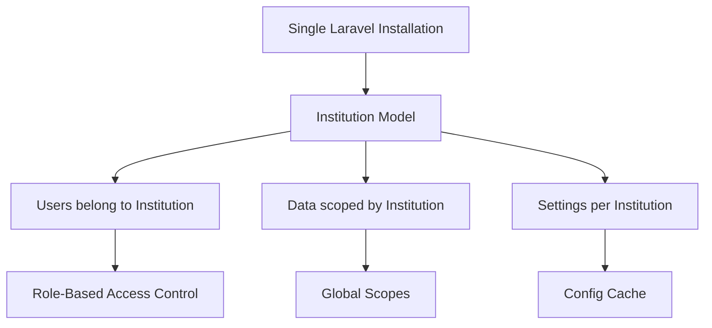
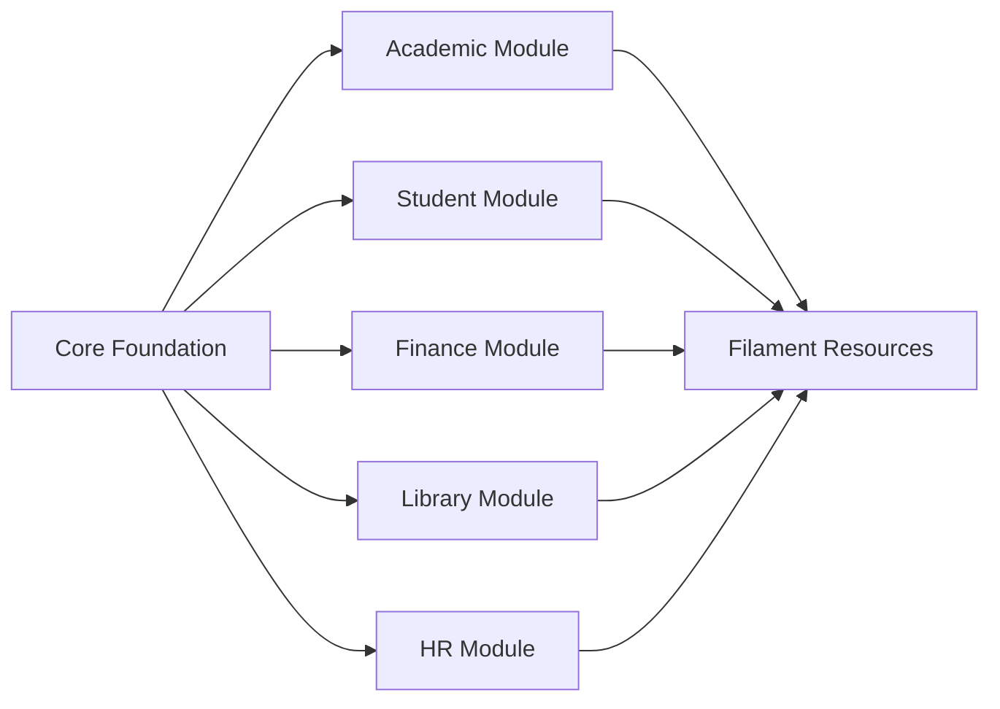
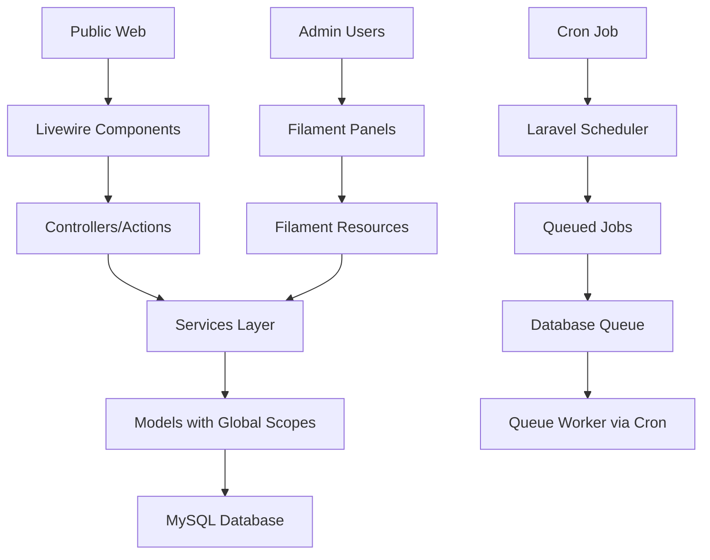

# SeminaryOS Architecture Overview

## Project Vision

**SeminaryOS** (University in a Box) is a future-ready Laravel application designed to provide comprehensive seminary and university management capabilities while maintaining compatibility with ICDSoft shared hosting environments.

## Core Principles

### 1. Shared Hosting First
- Primary deployment target: ICDSoft shared hosting
- No Docker, Redis, Meilisearch, WebSockets, or Supervisor required
- Apache-compatible routing with `.htaccess`
- Database queues instead of Redis queues
- File/database cache instead of Redis cache
- Cron-driven Laravel scheduler instead of Supervisor

### 2. Future-Ready Architecture
- Modular design for easy feature expansion
- Multi-institution ready from day one
- SaaS-capable architecture without premature complexity
- Clean separation of concerns
- Laravel conventions throughout

### 3. Technology Stack

#### Backend
- **PHP**: 8.4
- **Framework**: Laravel 12
- **Database**: MySQL 8.0+ or MariaDB 10.6+
- **Admin Panel**: FilamentPHP v4
- **Frontend**: Livewire v3 + Blade
- **Styling**: Tailwind CSS
- **Server**: Apache with mod_rewrite

#### Development Tools
- **Composer**: Dependency management
- **NPM/Bun**: Asset compilation (dev only)
- **Git**: Version control

#### Hosting Requirements
- PHP 8.4 with required extensions
- MySQL/MariaDB database
- SSH access for deployment
- Cron job capability
- Composer access
- 512MB+ memory limit (typical shared hosting)

## Architecture Patterns

### Multi-Institution Strategy



**Approach**: Single database, multi-tenancy via institution_id foreign keys
- No separate databases per institution
- Global scopes for automatic data isolation
- Middleware for institution context
- Shared users can access multiple institutions via pivot table

### Modular Structure



**Organization**:
- `app/Modules/` - Business logic modules
- `app/Core/` - Shared foundation code
- `app/Filament/` - Admin panel resources
- `resources/views/` - Public-facing Blade/Livewire views

### Data Flow Architecture



## Deployment Model

### Shared Hosting Constraints
- No persistent processes (no `queue:work` daemon)
- Limited memory per request
- No Redis or external services
- Apache with `.htaccess` routing
- Public files must be in `public_html` or similar

### Solution Architecture
1. **Queue Processing**: Cron runs `php artisan queue:work --stop-when-empty` every minute
2. **Task Scheduling**: Cron runs `php artisan schedule:run` every minute
3. **Cache**: File-based or database cache driver
4. **Sessions**: Database or file-based sessions
5. **File Storage**: Local disk storage with symlink to public
6. **Search**: MySQL fulltext indexes when needed

## Security Considerations

### Multi-Institution Isolation
- Global scopes on all institution-scoped models
- Middleware validates institution access
- Policies check institution ownership
- Database constraints prevent cross-institution data access

### Shared Hosting Security
- Environment variables in `.env` (outside public root)
- Database credentials secured
- File permissions properly set
- CSRF protection enabled
- XSS protection via Blade escaping
- SQL injection prevention via Eloquent/Query Builder

## Scalability Path

### Phase 1: Shared Hosting (Current)
- Single server
- File-based cache
- Database queues
- Local file storage

### Phase 2: Enhanced Shared Hosting
- Database cache for better performance
- Optimized indexes
- Query optimization
- Asset CDN for static files

### Phase 3: VPS Migration (Future)
- Redis cache + queues
- Dedicated queue workers
- Horizontal scaling preparation
- Full-text search engine

### Phase 4: SaaS Platform (Future)
- Multi-server architecture
- Load balancing
- Separate databases per institution
- Advanced monitoring
- API-first architecture

## Development Workflow

### Local Development
```bash
# Clone repository
git clone <repository-url>
cd SeminaryOS

# Install dependencies
composer install
npm install

# Configure environment
cp .env.example .env
php artisan key:generate

# Setup database
php artisan migrate
php artisan db:seed

# Build assets
npm run dev

# Start development server
php artisan serve
```

### Deployment to ICDSoft
```bash
# SSH into shared hosting
ssh user@host

# Navigate to application directory
cd ~/seminaryos

# Pull latest code
git pull origin main

# Install/update dependencies
composer install --no-dev --optimize-autoloader

# Run migrations
php artisan migrate --force

# Clear and cache config
php artisan config:cache
php artisan route:cache
php artisan view:cache

# Build production assets (if needed)
npm run build

# Set permissions
chmod -R 755 storage bootstrap/cache
```

## File Structure

```
SeminaryOS/
├── app/
│   ├── Core/                    # Foundation code
│   │   ├── Models/              # Base models
│   │   ├── Traits/              # Shared traits
│   │   ├── Scopes/              # Global scopes
│   │   └── Services/            # Core services
│   ├── Modules/                 # Business modules (future)
│   │   ├── Academic/
│   │   ├── Student/
│   │   ├── Finance/
│   │   └── Library/
│   ├── Filament/                # Filament admin
│   │   ├── Resources/
│   │   ├── Pages/
│   │   └── Widgets/
│   ├── Http/
│   │   ├── Controllers/
│   │   ├── Middleware/
│   │   └── Livewire/            # Public Livewire components
│   ├── Models/                  # Eloquent models
│   ├── Policies/                # Authorization policies
│   └── Providers/
├── bootstrap/
├── config/
├── database/
│   ├── migrations/
│   ├── seeders/
│   └── factories/
├── plans/                       # Architecture documentation
├── public/                      # Web root
│   ├── index.php
│   └── .htaccess
├── resources/
│   ├── views/
│   │   ├── livewire/
│   │   └── components/
│   ├── css/
│   └── js/
├── routes/
│   ├── web.php
│   ├── api.php
│   └── console.php
├── storage/
│   ├── app/
│   ├── framework/
│   └── logs/
├── tests/
├── .env.example
├── composer.json
├── package.json
├── artisan
└── README.md
```

## Next Steps

1. ✅ Architecture overview complete
2. ⏳ Multi-institution database design
3. ⏳ Shared hosting deployment guide
4. ⏳ Modular architecture implementation plan
5. ⏳ Laravel + Filament foundation setup guide

---

**Document Version**: 1.0  
**Last Updated**: 2026-06-02  
**Status**: Draft for Review
